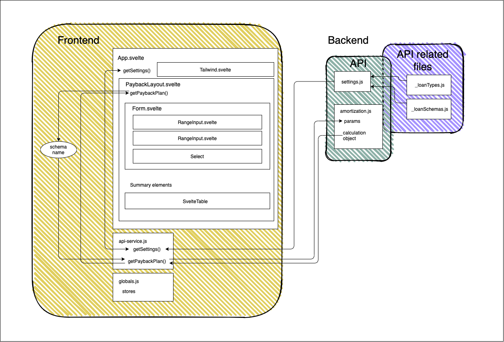

# Loan calculator based on [Svelte](https://svelte.dev)

Simple application which can be used for calculation of the cost from a housing loan based on loan amount, loan term and interest rate.

## Motivation

This application was created as a test take-home task for Wanda.space.

## Result

User is able to get calculated payback plan based on loan amount, loan term and interest rate. The application is built with ease of extention in mind. Two types of mortgage loans are available for selection (other type of loans can easily be added in `_loanTypes.js` file). Also, amortization model is used for all loan types calculations, but any amount of additional models can be added and wired to specific loan types. Calculations and settings are put in backend API to give better control over app settings without additional frontend development. That also gives the opportunity to serve logic and settings based on region/AB testing/etc.

## Stretch goals

- [ ] Write tests
- [x] Design adjustments (partially complited)
- [x] CI/CD
- [x] API integration

### Tech stack/libraries/tools

- HTML/CSS/JS
- [Node.js](https://nodejs.org/)
- [Svelte](https://svelte.dev/)
- [LESS](http://lesscss.org/)
- [Tailwind](https://tailwindcss.com/)
- [Axios](https://github.com/axios/axios)
- [Svelte table](https://github.com/dasDaniel/svelte-table)
- [Svelte select](https://github.com/rob-balfre/svelte-select)
- [Vercel](https://vercel.com/)

- [Draw.io (VS Code integration)](https://draw.io)

### Features 

- All basic logic moved to API for better scalability and less load on client-side
- Writable app data stores are used for better scalability and easier data usage
- Svelte ecosystem components used (table, select) to cut development time

Note: The code has been presented for demo purposes and may have some inconsistencies in styling.

## Architecture schema




## Installation

To install:

```
npm install
npm i -g vercel
```
---

To run locally:

```
npm run dev
vercel dev
```
---

To build:

```
npm run build
```
---

To deploy (you need to have vercel account set up):

```
vercel
```